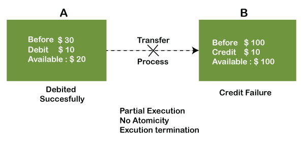
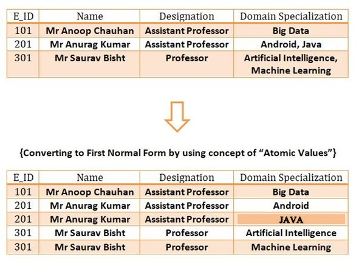

# Everything about Databases

---

---
# DATA
+ Data is a collection of facts and figures that can be processed to produce information.

+ Mostly data represents recordable facts. Data aids in producing information, which is based on facts.
---

---
# What is Database?
+ Collection of data.
+ Any collection of related information

+ To operate a large amount of information
+ To store, retrieve and manage data in the form of tables, reports, etc.
 
---

---
 # DBMS(Data Base Management System)

+ A special software program for creating and maintaining database.
+ DBMS stores the data in the form of files .
+ Manages various operations like 
-- Database creation
--Storing data in database
--updating data
--creating table in the database, etc.
--It maintains the consistency in case of multiple users.

---
 

---

# Characteristics of DBMS

+ ACID properties
  + Atomicity
  + Consistency
  + Isolation
  + Durability
+ ACID properties maintains the data in a healthy state.
---

+ Automatic backup and recovery procedures
+ Easy to manage large amounts of data
+ Handles security
+ Handles Importing/Exporting data
+ Reduce time, Improve efficency

---

# Disadvantages of DBMS

+ High Cost
+ Huge Size
+ Database Failure
+ Complexity
+ Performance

---
# RDBMS
  + Relational Database Management Systems
    + MySQL
    + PostgreSQL
    + MS SQL Server
    + IBM DB2
+ Table(rows & column)
   + In DBMS, the data is stored as a file, whereas in RDBMS, data is stored in the form of tables.
+  RDBMS uses SQL queries to access the data in the database.
+ Each row is a tuple.
---

---

# Advantages RDBMS over DBMS
+ Avoid Data Redundancy
+ RDBMS can process the complex and large amount of data.
+ Normalization of Tables
+ Modification of data is complex in DBMS while it is quite easy in RDBMS.
---
# Database design

---
# ER model
+ Entity Relationship model
  + High level data model
  + It defines conceptual view of the database.
  + Database stucture is portrayed in the form of a diagram called ER diagram

---

---
# Entity
  + object in the real wold
  + Anything which has an independent existence in the real world
  + nouns,objects,things
---
# Attributes
  + Describes each entity
  + Characteristics 
    + Simple- Can't be divided
    + Composite-Can be divided
    + stored
     + derived
     + Single valued
     + Multivalued

---

---
# ER Diagram
ER diagram is a graphical representation of entities and relationships in the database. 
 Following are some geometric shapes that are used to draw ER(Entity-relationship ) Diagram:
+ Rectangle: It represents the entity sets
+ Ellipses: It represents attributes
+ Diamond: It represents relationship set
+ Lines:  They link attributes to entity set and entity sets to the relationship sets
+ Double ellipses: It represents multi-valued attributes 
+ Dashed ellipses: It represents derived attributes 
----

---
# Cardinality ratio
+  To denote the number of entities to which another entity can be linked through a certain relation set.

----

---

---

---

----

# ER diagram to Tables
+ Each entity becomes a table.
+ Their attributes - their column
+ Each multivalued attribute is represented by a separate table.
---

----
# ACID Properties
+ Atomicity:
  + It means if any operation is performed on the data, either it should be performed or executed completely or should not be executed at all. It further means that the operation should not break in between or execute partially. In the case of executing operations on the transaction, the operation should be completely executed and not partially.
  ----

----

+  Consistency: 
   + It means if a change in the database is made, it should remain preserved always. 
   + In the case of transactions, the integrity of the data is very essential so that the database remains consistent before and after the transaction. The data should always be correct.

-----

+ Isolation:
  + Isolation is the property of a database where no data should affect the other one and may occur concurrently
  .

----
+ Durability:
  
   + Durability ensures that the data after the successful execution of the operation becomes permanent in the database. 
   + The durability of the data should be so perfect that even if the system fails or leads to a crash, the database still survives. However, if gets lost, it becomes the responsibility of the recovery manager for ensuring the durability of the database. 

----

# Introduction to MySQL
+ MySQL is a relational database management system
+ MySQL is open-source
+ MySQL is free
+ MySQL is ideal for both small and large applications
+ MySQL is very fast, reliable, scalable, and easy to use
+ MySQL is cross-platform
+ MySQL was first released in 1995
+ MySQL is developed, distributed, and supported by Oracle Corporation
+ MySQL is named after co-founder Monty Widenius's daughter: My
----
# Data types in MySQL
+ CHAR(size)
+ VARCHAR(size)
+ INT
+ FLOAT(size, d)
+ DOUBLE(size, d)
+ DATE
+ DATETIME()
+ BOOLEAN

----
# create database
The CREATE DATABASE statement is used to create a new SQL database.

  Syntax: 
  + CREATE DATABASE databasename;

  Example:
SQL statement creates a database called “SkillLync“
+ CREATE DATABASE  SkillLync;

# MySQL Show/List Databases
 + SHOW DATABASES;
  
  This command to list all databases in a MySQL database server.

 ----
 # DROP DATABASE Statement
 The drop database statement is to drop the existing database.
+ Syntax:

    DROP DATABASE databasename;

+ Example
   Dropping the existing database SkillLync.

  DROP DATABASE SkillLync

   ----
 # USE Database 
 The user wants to works on the databases.
+ Syntax:

  USE database_name;

+ Example

   USE dbmsWorkshop;
----
# Create table
The Create Table statement is used to create a new table in a database.
+ Syntax:

CREATE TABLE table_name ( 
  
column1 datatype,

column2 datatype,

column3 datatype, ...);

----
# Example - Create table

+ CREATE TABLE Persons ( PersonID int, LastName varchar(100), FirstName varchar(100),Address varchar(100), City varchar(100));

+ CREATE TABLE Student (
    StudentID int,
    StudentName varchar(100),
    Place varchar(100),
    DOB date
 );

 ----
 # DESCRIBE TABLE
 DESCRIBE command to show the structure of our table
+ Syntax

DESCRIBE table_name; 

+ Example

    DESCRIBE Students;

 ----

 # Keys
 + It is used to uniquely identify any record or row of data from the table. 
+ It is also used to establish and identify relationships between tables.
----

# Primary Key
+ A primary key is a field in a table which uniquely identifies each row/record in a database table.
+ Primary keys must contain UNIQUE values, and cannot contain NULL values.
+ A table can have only ONE primary key.

----
# Candidate key
+ A candidate key is an attribute or set of attributes that can uniquely identify a tuple.
+ Except for the primary key, the remaining attributes are considered a candidate key.

----
# FOREIGN KEY

+ A foreign key is the one that is used to link two tables together via a primary key.
+ If any attribute is set as primary key attribute will work in another table as Foreign key attribute.

----

----
# Primary key example:

create table persons (
personID int primary key,
LastName char(50),
FirstName char(50),
Age int
); 

----
# FOREIGN KEY

Create table orders(
 Orderid int,
OrderNumber int,
PersonID int,
 foreign key(PersonID) references persons(PersonID) 
 );

----
# Rename Table
This can rename one or more tables in the current database.
+ Syntax:

 RENAME table old_table TO new_table;

+ Example:

   Rename table Customer TO Customer1;

----
# Alter table

The ALTER TABLE statement is used to add , delete or modify columns in an existing table.

ALTER TABLE - ADD Column
+ Syntax

  ALTER TABLE table_name ADD column_name datatype;
+ Example

  ALTER TABLE persons ADD Email varchar(255);

----
# ALTER TABLE - DROP COLUMN
Syntax
  ALTER TABLE table_name DROP COLUMN column_name;

Example
    ALTER TABLE persons DROP COLUMN Email;

# ALTER TABLE - MODIFY COLUMN
+ Syntax
   ALTER TABLE table_name MODIFY COLUMN column_name datatype;

+ Example
   ALTER TABLE Persons MODIFY COLUMN FirstName char(50);

----
# 			Insert
The INSERT INTO statement is used to insert new records in a table.
INSERT INTO statement in two ways:

1. Specify both the columns names and the values to be insert
+ Syntax:

	INSERT INTO table_name (column1, column2, column3, ...) VALUES (value1, value2, value3, ...);

+ Example:

  + create table Teacher(
teacherID int,
teacherName char(50),
teacherPh int,
teacherCity char(100)
); 

  + insert into teacher(teacherID,teacherName,teacherPh,teacherCity) values(1,"john",789322,"bangalore");

----

2. Adding all the values for all the columns of the table.

+ syntax 

INSERT INTO table_name VALUES (value1, value2, value3, ...);

+ Example

insert into teacher values(2,“Tom",988754,"chennai");

select * from teacher;

----
# TRUNCATE Table

The TRUNCATE statement in MySQL removes the complete data without removing its structure

+ Syntax

   TRUNCATE TABLE table_name; 

+ Example

CREATE TABLE customer (Id int PRIMARY KEY ,    
Name varchar(50),Product varchar(50),     Country varchar(25),     
    Year int     
);  

----
# Drop table
MYSQL uses a Drop Table statement to delete the existing table

+ Syntax

 DROP TABLE  table_name;

 ----

----
# Types of Statements in SQL

+ Data Definition Language (DDL)
+ Data Query Language(DQL)
+ Data Manipulation Language (DML)

---
# Data Definition Language (DDL)
DDL is a set of SQL commands used to create, modify, and delete database structures but not data. 
List of DDL commands: 
+ CREATE: This command is used to create the database or its objects (like table, index, function, views, store procedure, and triggers).
+ DROP: This command is used to delete objects from the database.
+ ALTER: This is used to alter the structure of the database.
+ TRUNCATE: This is used to remove all records from a table, including all spaces allocated for the records are removed.
+ RENAME: This is used to rename an object existing in the database.

----
# Data Query Language(DQL)

+ DQL statements are used for performing queries on the data. It includes the SELECT statement. This command allows getting the data out of the database to perform operations with it.
+ List of DQL: 
	SELECT: It is used to retrieve data from the database.

---
 # Data Manipulation Language (DML)
  The SQL commands that deals with the manipulation of data present in the database belong to DML.
List of DML commands: 
+ INSERT : It is used to insert data into a table.
+ UPDATE: It is used to update existing data within a table.
+ DELETE : It is used to delete records from a database table.

----
# Update
The UPDATE statement is used to modify the existing records in a table.
+ Syntax:

  UPDATE table_name
  SET column1 = value1, column2 = value2, ...WHERE condition;
+ Example:

  UPDATE Customers
  SET ContactName='John'
  WHERE Country=‘India';

---
# Delete
The Delete statement is used to delete existing records in a table.
+ Syntax:

DELETE FROM table_name WHERE condition;

+ Example:

DELETE FROM Customers WHERE CustomerName=‘Preethy';

---
# MySQL Constraints

SQL constraints are used to specify rules for the data in a table.
+ NOT NULL - Ensures that a column cannot have a NULL value
+ UNIQUE - Ensures that all values in a column are different
PRIMARY KEY - A combination of a NOT NULL and UNIQUE. Uniquely identifies each row in a table
FOREIGN KEY - Prevents actions that would destroy links between tables
CHECK - Ensures that the values in a column satisfies a specific condition
DEFAULT - Sets a default value for a column if no value is specified.

----
# NOT NULL
By default, a column can hold NULL values.
+ The NOT NULL constraint enforces a column to NOT accept NULL values.
+ Example
CREATE TABLE Persons (ID int NOT NULL,LastName varchar(255) NOT NULL,  FirstName varchar(255) NOT NULL, Age int);

----
# UNIQUE

+ The UNIQUE constraint ensures that all values in a column are different.
+ Both the UNIQUE and PRIMARY KEY constraints provide a guarantee for uniqueness for a column or set of columns.
+ A PRIMARY KEY constraint automatically has a UNIQUE constraint.
+ you can have many UNIQUE constraints per table, but only one PRIMARY KEY constraint per table.
+ Example:

CREATE TABLE Persons (ID int NOT NULL,LastName varchar(255) NOT NULL,FirstName varchar(255), Age int, UNIQUE (ID));

----
# 		PRIMARY KEY
+ The PRIMARY KEY constraint uniquely identifies each record in a table.
+ Primary keys must contain UNIQUE values, and cannot contain NULL values.
+ A table can have only ONE primary key;

# 			FOREIGN KEY
+ The FOREIGN KEY constraint is used to prevent actions that would destroy links between tables.
+ A FOREIGN KEY is a field (or collection of fields) in one table, that refers to the PRIMARY KEY in another table.
+ The table with the foreign key is called the child table, and the table with the primary key is called the referenced or parent table.

----
# DEFAULT
+ The DEFAULT constraint is used to set a default value for a column.
+ The default value will be added to all new records, if no other value is specified.
+ Example:

CREATE TABLE Employee (ID int NOT NULL,LastName varchar(255) NOT NULL, FirstName varchar(255),Age int,City varchar(255) DEFAULT ‘Bangalore');

---
# CHECK
+ The CHECK constraint is used to limit the value range that can be placed in a column.
+ If you define a CHECK constraint on a column it will allow only certain values for this column.
+ If you define a CHECK constraint on a table it can limit the values in certain columns based on values in other columns in the row.
+ Example:

CREATE TABLE Persons ( ID int NOT NULL,LastName varchar(255) NOT NULL,FirstName varchar(255),Age int, CHECK (Age>=18));

----
# Select
+ The SELECT statement is used to select data from a database.
+ Syntax
SELECT column1, column2, ...FROM table_name;

+ Example
SELECT * FROM Customers;
SELECT CustomerName, City, Country FROM Customers;

----
# ORDER BY
+ SELECT * FROM Customers ORDER BY Country;
+ SELECT * FROM Customers ORDER BY Country ASC;
+ SELECT * FROM Customers ORDER BY Country DESC;
+ SELECT id,name,country FROM Customers ORDER BY Country;

# WHERE 
+ SELECT * FROM Customers WHERE Country = ‘India';
+ SELECT * FROM Customers WHERE id=3;

---
# AS
+ SELECT ID AS Cust_ID, Name AS Cust_name FROM Customers;
+ SELECT Cust_name , city AS “customer city” FROM Customers;

# DISTINCT
SELECT DISTINCT Country FROM Customers;

----
# Select with aggregate functions
An aggregate function performs a calculation on a set of values, and returns a single value.

+ COUNT() Function
+ SUM() Function
+ AVG() Function
+ MIN() Function

----

# count
The COUNT() function returns the number of rows in a database table.

+ SELECT COUNT(ProductID)
FROM Products;

---
# SUM()
+  SUM(Price)
FROM Products;

# AVG()
+ SELECT AVG(Price)
FROM Products;
# MIN()
+ SELECT MIN(Price)
FROM Products;

# MAX()
+ SELECT MAX(Price)
FROM Products;

----
# Operators in MySQL
+ Arithmetic Operators
+ Comparison Operators
+ Logical Operators
---
# Arithmetic Operators
+ '+' 	-	Add	
	Eg : SELECT 30 + 20;
+ '-'	-	Subract
	Eg : SELECT 30 - 20;
+ '*'	-	Multiply
	Eg : SELECT 30 * 20;
+ '/'	-	Divide
	Eg: SELECT 30 / 10;
+ '%'	-	Modulo
+ Eg: SELECT 17 % 5;

----
# Comparison Operators
+ '='	Equal to
+ '>'	Greater than
+ '<'	Less than
+ '>='	Greater than or equal to
+ '<=' 	Less than or equal to
+ '<>'	Not equal to

 Examples:

	  SELECT * FROM Products WHERE Price = 18;
	  SELECT * FROM Products WHERE Price > 30;
	  SELECT * FROM Products WHERE Price < 30;
	  SELECT * FROM Products WHERE Price >= 30;
	  SELECT * FROM Products WHERE Price <= 30;
	  SELECT * FROM Products WHERE Price <> 18;

---

# Logical Operators

+ AND		-	TRUE if all the conditions separated by AND is TRUE
+ OR		- 	TRUE if any of the conditions separated by OR is TRUE
+ NOT		-	Displays a record if the condition(s) is NOT TRUE
+ BETWEEN	-	TRUE if the operand is within the range of comparisons
+ IN		-	TRUE if the operand is equal to one of a list of expressions
+ NOT IN	- 	TRUE if the operand is not equal to one of a list of expressions

Examples:

+ SELECT * FROM Customers WHERE City = “Bangalore" AND Country = “India";
+ SELECT * FROM Customers WHERE City = “Delhi" OR City = “Pune“;
+ SELECT * FROM Customers WHERE NOT City = ‘Bangalore‘;
+ SELECT * FROM Students WHERE age BETWEEN 18 AND 25;
+ SELECT * FROM Customers WHERE City IN (‘Bangalore',‘Pune‘,’Delhi’);
+ SELECT * FROM Customers WHERE City NOT IN (‘Bangalore',‘Pune‘,’Delhi’);

----
# Wildcard Characters
A wildcard character is used to substitute one or more characters in a string.
+ %	Represents zero or more characters
+ _	Represents a single character

----
Examples:

+ SELECT * FROM Customers WHERE name LIKE ‘a%’;
+ SELECT * FROM Customers WHERE name LIKE '%a';
+ SELECT * FROM Customers WHERE City LIKE '%ab%';
+ SELECT * FROM Customers WHERE City LIKE '_ondon';

----
# MySQL GROUP BY Statement

+ The GROUP BY statement is often used with aggregate functions (COUNT(), MAX(), MIN(), SUM(), AVG()) to group the result-set by one or more columns.
+ Syntax
SELECT column_name(s) FROM table_name WHERE condition GROUP BY column_name(s) ORDER BY column_name(s);

 Example:

+ SELECT Department, sum(Salary) as Salary FROM employee
GROUP BY department;
+ SELECT COUNT(CustomerID), Country FROM Customers GROUP BY Country;
+ SELECT COUNT(CustomerID), Country FROM Customers GROUP BY Country ORDER BY COUNT(CustomerID) DESC; 

----
#   The MySQL HAVING Clause
The HAVING clause was added to SQL because the WHERE keyword cannot be used with aggregate functions.

+ Syntax:

SELECT column_name(s) FROM table_name WHERE condition GROUP BY column_name(s) HAVING condition ORDER BY column_name(s);

+ Example:

SELECT Department, sum(Salary) as Salary
FROM employee
GROUP BY department
HAVING SUM(Salary) >= 50000;

----
# Normalization in MySQL
+  Normalization is the process of organizing the data in the database.
+ Normalization split a large table into smaller tables and define relationships between them to increases the clarity in organizing data.
+ The normal form is used to reduce redundancy from the database table.
+ Save storage space.

----
The database normalization process is divided into following the normal form:
+ First Normal Form (1NF)
+ Second Normal Form (2NF)
+ Third Normal Form (3NF)
# First Normal Form (1NF)
+ Each column is unique in 1NF. 

---
# Second Normal Form (2NF)
+ The entity should be considered already in 1NF.
+ All attributes within the entity should depend solely on the unique identifier of the entity.
+ No partial dependency.

+ converting to 2NF

----
# MySQL Joins
+ A JOIN clause is used to combine rows from two or more tables, based on a related column between them.
sql-join

----

# Inner Join
+ The INNER JOIN keyword selects records that have matching values in both tables.

+ SELECT Customers.customer_id, Customers.first_name, Orders.amount
FROM Customers
INNER JOIN Orders
ON Customers.customer_id = Orders.customer;

---
# LEFT JOIN
+ The LEFT JOIN keyword returns all records from the left table (table1), and the matching records from the right table (table2). 
+ The result is 0 records from the right side, if there is no match.

+ SELECT Customers.customer_id, Customers.first_name, Orders.amount FROM Customers
LEFT JOIN Orders ON Customers.customer_id = Orders.customer;

----
# Right Join
+ The RIGHT JOIN keyword returns all records from the right table (table2), and the matching records from the left table (table1). 

+ SELECT Customers.customer_id, Customers.first_name, Orders.amount
FROM Customers
RIGHT JOIN Orders
ON Customers.customer_id = Orders.customer
----
# Cross Join/Cartesian Join
+ MySQL cross join is used to combine all possibilities of the two or more tables.

+ SELECT * FROM Meals 
CROSS JOIN Drinks;
----
# Self Join
+ A self join is a regular join, but the table is joined with itself.

+ SELECT A.CustomerName AS CustomerName1, B.CustomerName AS CustomerName2, A.City FROM Customers A, Customers WHERE A.CustomerID <> B.CustomerI AND A.City = B.City ORDER BY A.City;

----
# Views
+ A view is a virtual table based on the result-set of an SQL statement.
+ A view contains rows and columns, just like a real table. The fields in a view are fields from one or more real tables in the database.
+ Syntax

CREATE VIEW view_name AS SELECT column1, column2, ...FROM table_name WHERE condition;

+ Example

CREATE VIEW  BrazilCustomers  AS SELECT CustomerName, ContactName FROM Customers WHERE Country = 'Brazil';

----
+ CREATE VIEW customerPayments AS SELECT customerName, checkNumber, paymentDate, amount FROM customers INNER JOIN payments USING (customerNumber);

+ Dropping a View

DROP VIEW view_name;

----
# Indexes
+ Indexes are used to retrieve data from the database more quickly than otherwise. 
+ The users cannot see the indexes, they are just used to speed up searches/queries.
+ Syntax

CREATE INDEX index_name
ON table_name (column1, column2, ...);
+ Examples

 CREATE INDEX idx_lastname  ON Persons (LastName);

 ----
 # MySQL Subqueries
 + A subquery is a SQL query nested inside a larger query.

+ select fname,lname, salary from Employee
where salary >
       (select salary  from Employee
        where fname="Pooja");

+ SELECT Name, City FROM student  
    WHERE City NOT IN (  
    SELECT City FROM student2 WHERE City='Los Angeles');  

----
# Stored Procedures
+ A stored procedure is a prepared SQL code that you can save, so the code can be reused over and over again.
+ Example:

DELIMITER $$

CREATE PROCEDURE `dbmsworkshop`.`selectAllCountry`(IN ncountry VARCHAR(100))
BEGIN
SELECT * FROM customer WHERE country=ncountry;
END$$
DELIMITER ;

CALL selectAllCountry('US')

----

